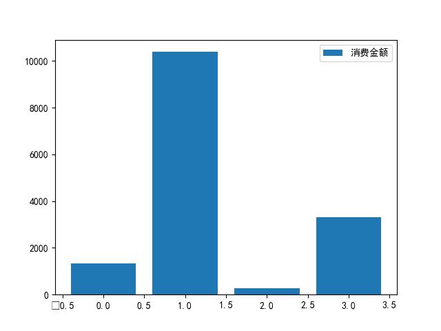

# 总结

Python数据分析期末大作业帮助我巩固和深入学习了Python相关知识，也给了我展示自身所学的机会。

## 题目一 学生校园消费行为分析

在读取数据的时候，因为表格里有中文，所以遇到了中文乱码的问题：

```python
data1 = read_csv("data1.csv", encoding='GB18030')
data2 = read_csv("data2.csv", encoding='GB18030')
data3 = read_csv("data3.csv", encoding='GB18030')
```

使用了`encoding='GB18030'`解决中文乱码问题。

对于刚刚拿到的数据，还不清楚数据的组织结构，所以先预览一部分数据：

```python
print(data1.head(3))
print(data2.head(3))
print(data3.head(3))
```

这些数据有些是不需要的，有些是我根本看不懂的，所以就去除了一部分：

```python
data1 = data1.drop('Index', axis=1)
data2 = data2.drop('Index', axis=1)
data3 = data3.drop('Index', axis=1)
data2 = data2.drop('PeoNo', axis=1)
data2 = data2.drop('TermNo', axis=1)
data2 = data2.drop('TermSerNo', axis=1)
data2 = data2.drop('conOperNo', axis=1)
data2 = data2.drop('OperNo', axis=1)
data3 = data3.drop('Describe', axis=1)
```

然后对于剩下的数据重新写入列名：

```python
data1.columns = ['卡号', '性别', '专业', '门禁卡号']
data2.columns = ['卡号', '时间', '消费金额', '存款金额', '结余', '刷卡次数', '类型', '部门']
data3.columns = ['门禁卡号', '时间', '地点', '访问']
```

接着是本次数据预处理的最后一步，查看有无缺失值或重复值：

```python
print(data1.isnull().any())
print(data2.isnull().any())
print(data3.isnull().any())
```

没有找到缺失值或重复值，接下来就是分析数据了，根据题目要求，先分析了学生的消费行为：

```python
data4 = data2[data2['类型'] == '消费']
date1 = to_datetime(data4['时间'])
time1 = date1.apply(lambda x: datetime.strftime(x, "%H"))
data4['时间（时）'] = time1
mpl.rcParams['font.sans-serif'] = ['simhei']
plot(data4.groupby('时间（时）').count())
title("消费人数")
show()
plot(data4.groupby('时间（时）')['消费金额'].sum())
title("消费金额")
show()
```


然后是分析食堂的运营状况：

```python
data5 = data4[data4['部门'] == '第一食堂']
data5 = data5.append(data4[data4['部门'] == '第二食堂'])
data5 = data5.append(data4[data4['部门'] == '第三食堂'])
data5 = data5.append(data4[data4['部门'] == '第四食堂'])
data5 = data5.append(data4[data4['部门'] == '第五食堂'])
pie(data5.groupby('部门')['部门'].count(), labels=[
    '第一食堂', '第三食堂', '第二食堂', '第五食堂', '第四食堂'])
show()
pie(data5.groupby('部门')['消费金额'].sum(), labels=[
    '第一食堂', '第三食堂', '第二食堂', '第五食堂', '第四食堂'])
show()
```

食堂消费人数：


食堂收入金额：


最后再构建学生消费细分模型，我最开始对于构建消费细分模型一头雾水，通过在网上查阅相关资料，主流的方法就是使用聚类分析探寻细分数目：

```python
data6 = DataFrame()
data6['消费金额'] = data4.groupby('卡号')['消费金额'].sum()
data6['结余'] = data4.groupby('卡号')['结余'].mean()
data7 = DataFrame()
data7['卡号'] = data4['卡号'].drop_duplicates()
n_clusters = 3
while(n_clusters < 6):
    k = KMeans(n_clusters=n_clusters)
    k.fit(data6)
    y_pred = k.predict(data6)
    print("when n_cluster = ", n_clusters)
    print("The silhouette_score = ", silhouette_score(data6, y_pred))
    n_clusters += 1
n_clusters = 4
k = KMeans(n_clusters=n_clusters)
k.fit(data6)
y_pred = k.predict(data6)
bar(y_pred, data6['消费金额'], label='消费金额')
legend()
show()
```

最后发现，当分为四类时，分类结果与数据集匹配度最高。



## 题目六 商品比价分析

看着书上关于爬虫的介绍，懵懵懂懂的就开始做了，最开始尝试爬取京东，爬取不到任何有用信息，上网查了一下，才知道有两种方法：

1. 设置cookie，让京东知道是谁在爬取
2. 设置UA，让京东不知道你在爬取

最后我选择了设置UA：

```python
header = {
    'user-agent': r'Mozilla/5.0 (Linux; Android 6.0; Nexus 5 Build/MRA58N) AppleWebKit/537.36 (KHTML, like Gecko) Chrome/91.0.4472.77 Mobile Safari/537.36 Edg/91.0.864.41'}
```

爬取成功之后，我确认需要的信息，找出他们的标识，最后确定了4个主要的块，利用书上教的方法把他们从网页源代码中提取出来：

```python
jdall = jdsoup.find_all(class_=[
                        'p-price', 'p-name-type-2', 'curr-shop hd-shopname', 'gl-item'])
```

然后自己对着提取出来的源代码，看了半天，找到了需要的信息前后统一的标识，唯一没找到的就是销量的值，位置找到了，但没内容，用正则表达式将他们分开来：

```python
jdALL = split(
    r'<i>|</i>|<li class="gl-item" data-sku="|" data-spu="', str(jdall))
```

这时候依旧一团乱麻，我就不断地找寻他们之间的关系，用正则表达式确定商品名称，找SKU，找价格，找店铺名：

```python
jdprice = []
shopname = []
sku = []
i = 3
while(i < len(jdALL)-11):
    if(search(r'<font class="skcolor_ljg">小米11</font> 5G', jdALL[i+1]) and search(r'^[0-9]*$', jdALL[i-2])):
        sku.append(jdALL[i-2])
        jdprice.append(float(jdALL[i]))
        j = 4
        while(True):
            jdALL2 = split(r'>|<', jdALL[i+j])
            if(len(jdALL2) > 6):
                if(search(r'^[\u4e00-\u9fa5]{1,}$', jdALL2[6])):
                    shopname.append(jdALL2[6])
                    i += 8
                    break
            j += 1
    i += 1
```

截至这里，才完成了第一页的处理，接下来研究如何翻页，进行了一下尝试：

1. 查看翻页按钮是否有URL，并没有，用的是JavaScript。
2. 因为鼠标放到按钮上有提示可以使用键盘的`->`进行翻页，所以想模拟键盘翻页，结果根本看不懂。
3. 把每一页的URL放在一起对比，找规律。

发现不同页面的URL只有两个地方的值不一样，一个是page，一个是s，page的规律很清晰，按照1、3、5、7、9类推，但s的规律就比较不好确定了，两个URL之间的s，有的是58，有的是57，其余的都是60，初步猜测应该是页面中第一个商品是整个搜索结果的第s个。找到了规律，只不过不是全部都遵循这一规律，所以代码就复制粘贴了几次。

这时候就要回去处理找不到销量的问题了，通过在网上查阅相关资料，答案指向了JavaScript文件，我就打开开发者工具，监视网络，刷新一下页面，筛选出JavaScript文件，一个一个找过去，找到存放销量数据的JavaScript文件，看到请求这个文件的URL有一大堆成串的数字，我下意识的觉得是SKU(好吧，我承认，SKU是后来加的，我没有这么远见)，大着胆子直接替换成我筛选出来的SKU，没想到居然成功拿到了销量数据：

```python
requeststr = 'https://club.jd.com/comment/productCommentSummaries.action?referenceIds='
for i in sku:
    requeststr += i+','
requeststr += '&callback=jQuery1100191&_=1623928017599'
requests = Request(requeststr, headers=header)
js = urlopen(requests).read()
jssoup = BeautifulSoup(js, "lxml")
jsall = split(r'"CommentCountStr":"|","CommentCount"', str(jssoup))
sales = []
i = 1
while(i < len(jsall)):
    sales.append(jsall[i])
    i += 2
for i in range(len(sales)):
    sales[i] = sub('万', '0000', sales[i])
    sales[i] = sub('\+', '', sales[i])
    sales[i] = int(sales[i])
```

最后就是非常简约的对销量和价格可视化：

```python
mpl.rcParams['font.sans-serif'] = ['simhei']
bar(shopname, sales)
title('销量')
show()
scatter(shopname, jdprice)
title('价格')
show()
```


看到有一家店铺的销量一柱擎天，让我看看是哪家店铺这么厉害：

```python
maxIndex = 0
for i in range(len(sales)):
    if(sales[i] > sales[maxIndex]):
        maxIndex = i
max = jdprice[maxIndex]
print(jdprice[maxIndex])
print(shopname[maxIndex])
jdprice.sort()
print(jdprice.index(max))
print('最低价格：', jdprice[0])
```

原来是官方的店铺，打扰了。

更多内容请看：https://github.com/ZZZCNY/Python-data-analysis.git

