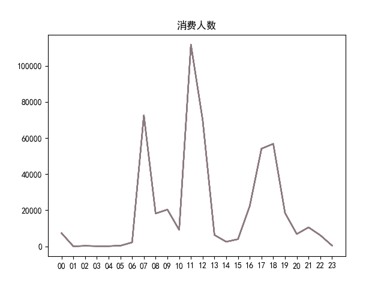
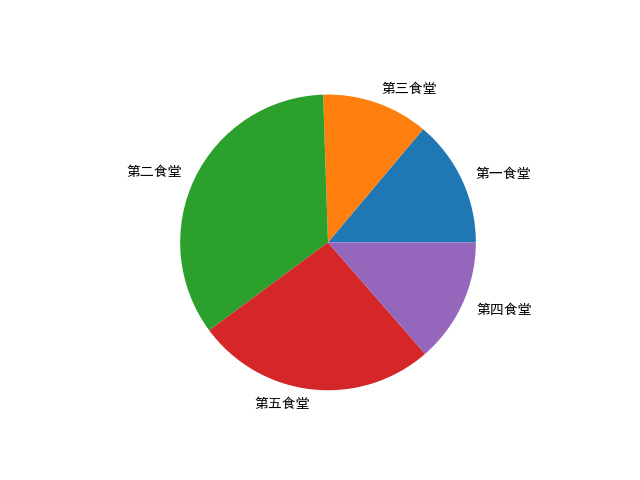

# 系统分析文档

## 背景

校园一卡通是集身份认证、金融消费、数据共享等多项功能于一体的信息集成系统。在为师生提供优质、高效信息化服务的同时，系统自身也积累了大量的历史记录，其中蕴含着学生的消费行为以及学校食堂等各部门的运行状况等信息。很多高校基于校园一卡通系统进行“智慧校园”的相关建设，例如《扬子晚报》2016年1月27日的报道：《南理工给贫困生“暖心饭卡补助”》。

不用申请，不用审核，饭卡上竟然能悄悄多出几百元……，南理工教育基金会正式启动了“暖心饭卡”项目，针对特困生的温饱问题进行“精准援助”。

项目专门针对贫困本科生的“温饱问题”进行援助。在学校一卡通中心，教育基金会的工作人员找来了全校一万六千余名在校本科生9月中旬到11月中旬的刷卡记录，对所有的记录进行了大数据分析。最终圈定了500余名“准援助对象”。

南理工教育基金会将拿出“种子基金”100万元作为启动资金，根据每位贫困学生的不同情况确定具体的补助金额，然后将这些钱“悄无声息”的打入学生的饭卡中，保证困难学生能够吃饱饭。

——《扬子晚报》2016年1月27日：南理工给贫困生“暖心饭卡补助”

本题提供国内某高校校园一卡通系统一个月的运行数据，请使用数据分析和建模的方法，挖掘数据中所蕴含的信息，分析学生在校园内的学习生活行为，为改进学校服务并为相关部门的决策提供信息支持。

## 目标

1. 分析学生的消费行为和食堂的运营状况，为食堂运营提供建议。

2. 构建学生消费细分模型，为学校判定学生的经济状况提供参考意见。

## 数据预处理

1. 预览数据

   ```python
   print(data1.head(3))
   print(data2.head(3))
   print(data3.head(3))
   ```

   >    Index  CardNo Sex   Major  AccessCardNo
   > 0      1  180001   男  18国际金融      19762330
   > 1      2  180002   男  18国际金融      20521594
   > 2      3  180003   男  18国际金融      20513946
   >        Index  CardNo     PeoNo             Date  Money  FundMoney  Surplus  CardCount Type  TermNo TermSerNo  conOperNo  OperNo  Dept
   > 0  117342773  181316  20181316  2019/4/20 20:17    3.0        0.0    186.1        818   消费      49       NaN        NaN     235  第一食堂
   > 1  117344766  181316  20181316   2019/4/20 8:47    0.5        0.0    199.5        814   消费      63       NaN        NaN      27  第二食堂
   > 2  117346258  181316  20181316   2019/4/22 7:27    0.5        0.0    183.1        820   消费      63       NaN        NaN      27  第二食堂
   >      Index  AccessCardNo           Date    Address  Access Describe
   > 0  1330906      25558880  2019/4/1 0:00  第六教学楼[进门]       1     允许通过
   > 1  1330907      18413143  2019/4/1 0:02  第六教学楼[出门]       1     允许通过
   > 2  1331384      11642752  2019/4/1 0:00    飞凤轩[进门]       1     允许通过

2. 尝试解释数据，并删除无法解释和不需要的数据

   ```python
   data1=data1.drop('Index',axis=1)
   data2=data2.drop('Index',axis=1)
   data3=data3.drop('Index',axis=1)
   data2=data2.drop('PeoNo',axis=1)
   data2=data2.drop('TermNo',axis=1)
   data2=data2.drop('TermSerNo',axis=1)
   data2=data2.drop('conOperNo',axis=1)
   data2=data2.drop('OperNo',axis=1)
   data3=data3.drop('Describe',axis=1)
   data1.columns=['卡号','性别','专业','门禁卡号']
   data2.columns=['卡号','时间','消费金额','存款金额','结余','刷卡次数','类型','部门']
   data3.columns=['门禁卡号','时间','地点','访问']
   ```

3. 查看是否有缺失值

   ```python
   print(data1.isnull().any())
   print(data2.isnull().any())
   print(data3.isnull().any())
   ```

   > 卡号      False
   > 性别      False
   > 专业      False
   > 门禁卡号    False
   > dtype: bool
   > 卡号      False
   > 时间      False
   > 消费金额    False
   > 存款金额    False
   > 结余      False
   > 刷卡次数    False
   > 类型      False
   > 部门      False
   > dtype: bool
   > 门禁卡号    False
   > 时间      False
   > 地点      False
   > 访问      False
   > dtype: bool

## 分析学生的消费行为

```python
data4 = data2[data2['类型'] == '消费']
date1 = to_datetime(data4['时间'])
time1 = date1.apply(lambda x: datetime.strftime(x, "%H"))
data4['时间（时）'] = time1
plot(data4.groupby('时间（时）').count())
title("消费人数")
show()
plot(data4.groupby('时间（时）')['消费金额'].sum())
title("消费金额")
show()
```


1. 学生消费记录全天分布
   

2. 学生消费金额全天分布
   

## 分析食堂的运营状况

```python
data5 = data4[data4['部门'] == '第一食堂']
data5 = data5.append(data4[data4['部门'] == '第二食堂'])
data5 = data5.append(data4[data4['部门'] == '第三食堂'])
data5 = data5.append(data4[data4['部门'] == '第四食堂'])
data5 = data5.append(data4[data4['部门'] == '第五食堂'])
pie(data5.groupby('部门')['部门'].count(), labels=[
    '第一食堂', '第三食堂', '第二食堂', '第五食堂', '第四食堂'])
show()
pie(data5.groupby('部门')['消费金额'].sum(), labels=[
    '第一食堂', '第三食堂', '第二食堂', '第五食堂', '第四食堂'])
show()
```


1. 食堂人数对比
   

2. 食堂收入对比
   

## 构建学生消费细分模型

```python
data6 = DataFrame()
data6['消费金额'] = data4.groupby('卡号')['消费金额'].sum()
data6['结余']=data4.groupby('卡号')['结余'].mean()
data7 = DataFrame()
data7['卡号'] = data4['卡号'].drop_duplicates()
n_clusters = 3
while(n_clusters < 6):
    k = KMeans(n_clusters=n_clusters)
    k.fit(data6)
    y_pred = k.predict(data6)
    print("when n_cluster = ",n_clusters)
    print("The silhouette_score = ",silhouette_score(data6,y_pred))
    n_clusters += 1
n_clusters = 4
k = KMeans(n_clusters=n_clusters)
k.fit(data6)
y_pred = k.predict(data6)
bar(y_pred, data6['消费金额'], label='消费金额')
legend()
show()
```


1. 探寻不同细分数量对分类精度的影响

   > when n_cluster =  3
   > The silhouette_score =  0.5338960796299432
   > when n_cluster =  4
   > The silhouette_score =  0.5384162255314494
   > when n_cluster =  5
   > The silhouette_score =  0.4867707105866443

结论：将学生分为4类时，平均轮廓系数最高，与数据集相匹配。

2. 该细分模型下，学生的月累计最大消费金额如下：
   

