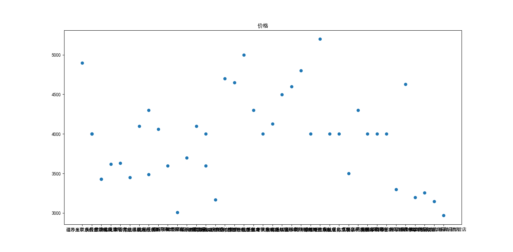

# 系统分析文档

## 背景

同一件商品在不同的平台上价格不同，在同一平台上不同店铺价格也不同。

## 目标

1. 爬取同一件商品的平台/店铺的价格、评分、评价等内容

2. 分析爬取结果，可视化显示

3. 给出结论

## 数据预处理

1. 数据获取情况

   |      | 官方 | 京东 | 淘宝 |
   | ---- | ---- | ---- | ---- |
   | 价格 | √    | √    | ×    |
   | 评分 | ×    | √    | ×    |
   | 评价 | ×    | ×    | ×    |

2. 获取数据

   ```python
   xm = urlopen('https://www.mi.com/').read()
   xmsoup = BeautifulSoup(xm, "lxml")
   xmall = xmsoup.find_all(class_=['title', 'price'])
   xmALL = split(
       r'</p>, <div class="title">|</div>, <p class="price">|<div class="title">', str(xmall))
   for i in range(len(xmALL)):
       if(xmALL[i] == '小米11 Ultra'):
           mi11uprice = match(r'\d*', xmALL[i+1]).group()
       if(xmALL[i] == '小米11 Pro'):
           mi11pprice = match(r'\d*', xmALL[i+1]).group()
       if(xmALL[i] == '小米11'):
           mi11price = match(r'\d*', xmALL[i+1]).group()
   header = {
       'user-agent': r'Mozilla/5.0 (Linux; Android 6.0; Nexus 5 Build/MRA58N) AppleWebKit/537.36 (KHTML, like Gecko) Chrome/91.0.4472.77 Mobile Safari/537.36 Edg/91.0.864.41'}
   requests = Request(
       'https://search.jd.com/search?keyword=%E5%B0%8F%E7%B1%B311%20Ultra&qrst=1&wq=%E5%B0%8F%E7%B1%B311%20Ultra&ev=exbrand_%E5%B0%8F%E7%B1%B3%EF%BC%88MI%EF%BC%89%5E&cid3=655', headers=header)
   jd = urlopen(requests).read()
   jdsoup = BeautifulSoup(jd, "lxml")
   jdall = jdsoup.find_all(class_='p-price')
   jdALL = split(r'<i>|</i>', str(jdall))
   jdmi11uprice = []
   i = 1
   while(i < len(jdALL)):
       jdmi11uprice.append(float(jdALL[i]))
       i += 2
   jdall = jdsoup.find_all(class_='p-shop')
   jdALL = split(
       r'data-reputation="|" data-score="|" data-selfware="', str(jdall))
   jdmi11ureputation = []
   jdmi11uscore = []
   i = 1
   while(i < len(jdALL)):
       try:
           jdmi11ureputation.append(float(jdALL[i]))
       except:
           jdmi11ureputation.append(0)
       i += 1
       jdmi11uscore.append(float(jdALL[i]))
       i += 2
   requests = Request(
       'https://search.jd.com/search?keyword=%E5%B0%8F%E7%B1%B311%20Pro&qrst=1&wq=%E5%B0%8F%E7%B1%B311%20Pro&ev=exbrand_%E5%B0%8F%E7%B1%B3%EF%BC%88MI%EF%BC%89%5E&cid3=655', headers=header)
   jd = urlopen(requests).read()
   jdsoup = BeautifulSoup(jd, "lxml")
   jdall = jdsoup.find_all(class_='p-price')
   jdALL = split(r'<i>|</i>', str(jdall))
   jdmi11pprice = []
   i = 1
   while(i < len(jdALL)):
       jdmi11pprice.append(float(jdALL[i]))
       i += 2
   jdall = jdsoup.find_all(class_='p-shop')
   jdALL = split(
       r'data-reputation="|" data-score="|" data-selfware="', str(jdall))
   jdmi11preputation = []
   jdmi11pscore = []
   i = 1
   while(i < len(jdALL)):
       try:
           jdmi11preputation.append(float(jdALL[i]))
       except:
           jdmi11preputation.append(0)
       i += 1
       jdmi11pscore.append(float(jdALL[i]))
       i += 2
   requests = Request(
       'https://search.jd.com/search?keyword=%E5%B0%8F%E7%B1%B311&qrst=1&wq=%E5%B0%8F%E7%B1%B311&ev=exbrand_%E5%B0%8F%E7%B1%B3%EF%BC%88MI%EF%BC%89%5E&cid3=655', headers=header)
   jd = urlopen(requests).read()
   jdsoup = BeautifulSoup(jd, "lxml")
   jdall = jdsoup.find_all(class_='p-price')
   jdALL = split(r'<i>|</i>', str(jdall))
   jdmi11price = []
   i = 1
   while(i < len(jdALL)):
       jdmi11price.append(float(jdALL[i]))
       i += 2
   jdall = jdsoup.find_all(class_='p-shop')
   jdALL = split(
       r'data-reputation="|" data-score="|" data-selfware="', str(jdall))
   jdmi11reputation = []
   jdmi11score = []
   i = 1
   while(i < len(jdALL)):
       try:
           jdmi11reputation.append(float(jdALL[i]))
       except:
           jdmi11reputation.append(0)
       i += 1
       jdmi11score.append(float(jdALL[i]))
       i += 2
   ```

## 可视化显示

对京东优先展示的30家店铺进行分析。

```python
plot(range(len(jdmi11uprice)), jdmi11uprice, '.', label='京东价格')
plot([0, len(jdmi11uprice)], [float(mi11uprice),
     float(mi11uprice)], label='官方价格')
legend()
title('小米11 Ultra价格')
show()
bar(range(len(jdmi11ureputation)), jdmi11ureputation)
title('小米11 Ultra评分')
show()
bar(range(len(jdmi11uscore)), jdmi11uscore)
title('小米11 Ultra销量')
show()
sum = 0
for i in jdmi11uscore:
    sum += i
print('小米11 Ultra销量：', sum)
avg = 0
for i in jdmi11ureputation:
    avg += i
avg /= len(jdmi11ureputation)
print('小米11 Ultra评分：', avg)
plot(range(len(jdmi11pprice)), jdmi11pprice, '.', label='京东价格')
plot([0, len(jdmi11pprice)], [float(mi11pprice),
     float(mi11pprice)], label='官方价格')
legend()
title('小米11 Pro价格')
show()
bar(range(len(jdmi11preputation)), jdmi11preputation)
title('小米11 Pro评分')
show()
bar(range(len(jdmi11pscore)), jdmi11pscore)
title('小米11 Pro销量')
show()
sum = 0
for i in jdmi11pscore:
    sum += i
print('小米11 Pro销量：', sum)
avg = 0
for i in jdmi11preputation:
    avg += i
avg /= len(jdmi11preputation)
print('小米11 Pro评分：', avg)
plot(range(len(jdmi11price)), jdmi11price, '.', label='京东价格')
plot([0, len(jdmi11price)], [float(mi11price),
     float(mi11price)], label='官方价格')
legend()
title('小米11价格')
show()
bar(range(len(jdmi11reputation)), jdmi11reputation)
title('小米11评分')
show()
bar(range(len(jdmi11score)), jdmi11score)
title('小米11销量')
show()
sum = 0
for i in jdmi11score:
    sum += i
print('小米11销量：', sum)
avg = 0
for i in jdmi11reputation:
    avg += i
avg /= len(jdmi11reputation)
print('小米11评分：', avg)
```


1. 价格对比


2. 销量： （单位：万）

   小米11 Ultra销量： 125.0


   小米11 Pro销量： 144.0


   小米11销量： 130.0


3. 评分： （单位：%）

   小米11 Ultra评分： 90.36666666666666



   小米11 Pro评分： 95.3


   小米11评分： 85.76666666666667


