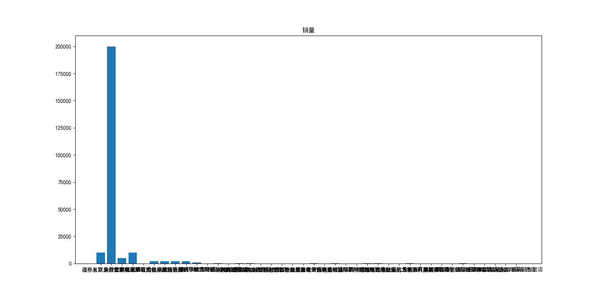

# 系统分析文档

## 背景

同一件商品在不同的平台上价格不同，在同一平台上不同店铺价格也不同。

## 目标

1. 爬取同一件商品的平台/店铺的价格、评分、评价等内容

2. 分析爬取结果，可视化显示

3. 给出结论

## 数据预处理

1. 数据获取情况

   |      | 官方 | 京东 | 淘宝 |
   | ---- | ---- | ---- | ---- |
   | 价格 | √    | √    | ×    |
   | 评分 | ×    | √    | ×    |
   | 评价 | ×    | ×    | ×    |

2. 获取数据

   ```python
   xm = urlopen('https://www.mi.com/').read()
   xmsoup = BeautifulSoup(xm, "lxml")
   xmall = xmsoup.find_all(class_=['title', 'price'])
   xmALL = split(
       r'</p>, <div class="title">|</div>, <p class="price">|<div class="title">', str(xmall))
   for i in range(len(xmALL)):
       if(xmALL[i] == '小米11 Ultra'):
           xmprice = match(r'\d*', xmALL[i+1]).group()
           break
   header = {
       'user-agent': r'Mozilla/5.0 (Linux; Android 6.0; Nexus 5 Build/MRA58N) AppleWebKit/537.36 (KHTML, like Gecko) Chrome/91.0.4472.77 Mobile Safari/537.36 Edg/91.0.864.41'}
   requests = Request(
       'https://search.jd.com/search?keyword=%E5%B0%8F%E7%B1%B311%20Ultra&qrst=1&wq=%E5%B0%8F%E7%B1%B311%20Ultra&ev=exbrand_%E5%B0%8F%E7%B1%B3%EF%BC%88MI%EF%BC%89%5E&cid3=655', headers=header)
   jd = urlopen(requests).read()
   jdsoup = BeautifulSoup(jd, "lxml")
   jdall = jdsoup.find_all(class_='p-price')
   jdALL = split(r'<i>|</i>', str(jdall))
   jdprice = []
   i = 1
   while(i < len(jdALL)):
       jdprice.append(jdALL[i])
       i += 2
   jdall = jdsoup.find_all(class_='p-shop')
   jdALL = split(
       r'data-reputation="|" data-score="|" data-selfware="', str(jdall))
   jdreputation = []
   jdscore = []
   i = 1
   while(i < len(jdALL)):
       jdreputation.append(jdALL[i])
       i += 1
       jdscore.append(jdALL[i])
       i += 2
   ```

## 可视化显示

对京东优先展示的30家店铺进行分析。

```python
plot(range(len(jdprice)), jdprice, '.', label='京东价格')
plot([0, len(jdprice)], [float(xmprice), float(xmprice)], label='官方价格')
legend()
title('价格')
show()
bar(range(len(jdreputation)), jdreputation)
title('评分')
show()
bar(range(len(jdscore)), jdscore)
title('销量')
show()
sum = 0
for i in jdscore:
    sum += i
print('销量：', sum)
avg = 0
for i in jdreputation:
    avg += i
avg /= len(jdreputation)
print('评分：', avg)
```


1. 价格对比



2. 销量： 118.0（单位：万）


3. 评分： 83.76666666666667（单位：%）


