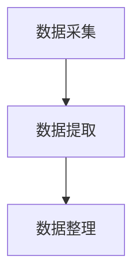

# 商品比价分析

## 摘要

小米618开新狂欢季已经结束，小米618的终极战报也已出炉：从6月1日-18日，全平台支付金额破190亿，同比增长90%！

手机品类荣获全平台安卓手机品牌销量全第一，电视品类包揽全平台销量/销额双第一，新风空调品类拿下全平台销量/销额双第一，小米AIoT更是狂揽全平台158项第一！

本课题选取了小米11作为研究对象，因为小米在过去的618期间，取得了京东4000-5000元价位段安卓手机销量第一，仅小米11一款机型，京东平台累计销量超45万，极具代表性。我们希望可以通过数据分析，给用户和商家一些参考。

关键词：爬虫，散点图，柱状图

[toc]

## 研究背景

电子商务通常是指在全球各地广泛的商业贸易活动中，在因特网开放的网络环境下，基于客户端/服务端应用方式，买卖双方不谋面地进行各种商贸活动，实现消费者的网上购物、商户之间的网上交易和在线电子支付以及各种商务活动、交易活动、金融活动和相关的综合服务活动的一种新型的商业运营模式。各国政府、学者、企业界人士根据自己所处的地位和对电子商务参与的角度和程度的不同，给出了许多不同的定义。电子商务分为：ABC、B2B、B2C、C2C、B2M、M2C、B2A（即B2G）、C2A（即C2G）、O2O等。

电子商务是因特网爆炸式发展的直接产物，是网络技术应用的全新发展方向。因特网本身所具有的开放性、全球性、低成本、高效率的特点，也成为电子商务的内在特征，并使得电子商务大大超越了作为一种新的贸易形式所具有的价值，它不仅会改变企业本身的生产、经营、管理活动，而且将影响到整个社会的经济运行与结构。以互联网为依托的“电子”技术平台为传统商务活动提供了一个无比宽阔的发展空间，其突出的优越性是传统媒介手段根本无法比拟的。

现如今，各个行业都形成了一个中心的多平台销售模式，即官网销售产品的同时入驻第三方平台，而其中又以京东和淘宝两大电商平台最为庞大，不仅有官方入驻，还有众多第三方店铺在其中销售，而消费者常常会纠结于购买商品的店铺。本课题选取了近十年来发展最为迅猛的手机行业进行研究，为消费者的购物提供参考。

2019年，手机市场开始由增量市场转为存量市场，经过过去5年的洗牌，国内的手机行业的格局由中华酷联变成了HMOV，无数趁着红海赶来的商人，还没等站起来就倒下了。2021年，华为遭受美国的制裁，在海外的市场份额一落千丈，而在国内也为了营销减少供货以保持热度。也就是在这一年，小米在海外强势崛起，以超高的增长速度直逼苹果，一跃成为世界第三大智能手机制造商，新一代数字系列旗舰小米11系列也在市场上大放异彩。

越来越多的人通过第三方电子商务交易平台成为站内经营者，其中不乏一些官方授权或抢购倒卖的商家，他们大多都有自主定价权，这就加剧了第三方平台的竞争，同时也影响了消费者的购物体验。

## 研究意义

新的换机潮来临，恰逢一年一度的618，各大品牌明争暗斗，6月第一天就不约而同的发布了618的第一份战报，不仅如此，第三方平台的众多商家也不断推出优惠，希望借着这个契机赚钱，也成为了各大品牌冲击销量榜的助力。但消费者往往更在意的不是各品牌的销量，而是如何花最少的钱买到最适合自己的手机。

## 相关理论和技术

### 数据预处理

1. 正则表达式

   正则表达式是一种用来匹配字符串的强有力的工具。它的设计思想是用一种描述性的语言来给字符串定义一个规则，凡是符合规则的字符串，我们就认为它“匹配”了，否则，该字符串就是不合法的。

   在正则表达式中，如果直接给出字符，就是精准匹配。用`\d`可以匹配一个数字，用`\w`可以匹配一个字母或数字，用英文句点可以匹配任意字符，用`*`表示任意个字符（包括0个），用`+`表示至少一个字符，用`?`表示0个或1个字符，用`{n}`表示n个字符，用`{n,m}`表示n到m个字符。

   | 符号    | 含义                                                         |
   | ------- | ------------------------------------------------------------ |
   | `*`     | 匹配前面的字符、表达式或括号里的字符0次或多次                |
   | `+`     | 匹配前面的字符、表达式或括号里的字符至少一次                 |
   | `?`     | 匹配前面的一次或0次                                          |
   | `.`     | 匹配任意单个字符，包括数字、空格和符号                       |
   | `[]`    | 匹配[]内的任意一个字符，即任选一个                           |
   | `\`     | 转义符，把后面的特殊意义的符号按原样输出                     |
   | `^`     | 指字符串开始位置的字符或子表达式                             |
   | `$`     | 经常用在表达式的末端，表示从字符串的末端匹配，如果不用它，则每个正则表达式的实际表达形式都带有.*作为结尾。这个符号可以看成^符号的反义词 |
   | `|`     | 匹配任意一个由\|分割的部分                                   |
   | `?!`    | 不包含，这个组合经常放在字符或者正则表达式前面，表示这些字符不能出现。如果在某整个字符串中全部排除某个字符，就要加上^和$符号 |
   | `()`    | 表达式编组，()内的正则表达式会优先运行                       |
   | `{m,n}` | 匹配前面的字符串或表达式m到n次，包含m和n次                   |
   | `[^]`   | 匹配任意一个不在中括号内的字符                               |
   | `\d`    | 匹配一位数字                                                 |
   | `\D`    | 匹配一位非数字                                               |
   | `\w`    | 匹配一个字母或数字                                           |

   Python提供re模块，包含所有正则表达式的功能。用正则表达式切分字符串比用固定的字符更灵活。除了简单地判断是否匹配之外，正则表达式还有提取字串的强大功能。

2. 使用urllib打开网页

   使用urllib模块打开网站，整个程序只需用两行代码即可：

   ```python
   import urllib
   print(urllib.request.urlopen('http://www.i-nuc.com/iNUC').read())
   ```

   在Python 2.x版本中可以直接使用`improt urllib`来进行操作，但是3.x版本的Python中，使用的是`improt urllib.request`来进行操作。

   urlopen方法的格式：

   ```python
   urllib.request.urlopen(url[,data[,proxies]])
   ```

   参数URL表示远程数据的路径，一般是网址；参数data表示以post方式提交到URL的数据；参数proxies用于设置代理。

   urlopen返回一个类文件对象，它提供了下列方法。

   - *`read()`、`readline()`、`readlines()`、`fileno()`、`close()`：这些方法的使用方式与文件对象完全一样。
   - *`info()`：返回一个`httplib.HTTPMessage`对象，表示远程服务器返回的头信息。
   - *`getcode()`：返回HTTP状态码。如果是HTTP请求，200表示请求成功完成；404表示网址未找到。
   - *`geturl()`：返回请求的URL。

3. 设置headers

   请求头headers是我们请求网页时携带的信息，有一些网站会根据headers来判断请求是不是爬虫，我们需要通过伪造headers来绕过这种反爬机制。

   先打开一个网页，右键-检查-选择network，刷新网页，找到第一个文件，查看requests headers。我们可以看到headers以键值对的形式呈现在我们面前，这就是我们用浏览器时，访问网页携带的信息。

   User-Agent顾名思义，就是指谁来代替我们访问网页的。如果它对应的是requests库，那么对方网站就可以直接看出你是爬虫而拒绝这次请求。

### 数据可视化

1. 散点图

   散点图(scatter diagram)是以一个变量为横坐标，另一个变量为纵坐标，利用散点(坐标点)的分布形态反应变量关系的一种图形。相关的方法如下：

   ```python
   plt.plot(x,y, '.',color=(r,g,b))
   plt.xlabel('x轴坐标')
   plt.ylabel('y轴坐标')
   plt.grid(True)
   ```

   x、y——X轴和Y轴的序列。

   '.'、'o'——小点还是大点。

   Color——散点图的颜色，可以用RGB定义，也可以用英文字母定义。

   RGB颜色的设置：(red,green,blue)，由红绿蓝颜色组成。

   常用RGB颜色见下表

   | 颜色 | 英文   | RGB              | 十六进制 |
   | ---- | ------ | ---------------- | -------- |
   | 白色 | white  | (1,1,1)          | #FFFFFF  |
   | 黑色 | black  | (0,0,0)          | #000000  |
   | 红色 | red    | (1,0,0)          | #FF0000  |
   | 橙色 | orange | (1,0.5,0)        | #FFA500  |
   | 黄色 | yellow | (1,1,0)          | #FFFF00  |
   | 绿色 | green  | (0,1,0)          | #00FF00  |
   | 蓝色 | blue   | (0,0,1)          | #0000FF  |
   | 靛色 | indigo | (0.3,0,0.5)      | #4B0082  |
   | 紫色 | purple | (0.63,0.13,0.95) | #A020F0  |

2. 柱形图

   柱形图用于显示一段时间内的数据变化或显示各项之间的比较情况，是一种单位长度的长方形，根据数据大小绘制的统计图，用来比较两个或以上的数据。

   ```python
   bar(left,height,width,color)
   barh(bottom,width,height,color)
   ```

## 实验过程

### 实验准备

本课题使用的是Python 3.9.5 64-bit。Python是一种简单易学、功能强大的编程语言，它有高效率的高层数据结构，能简单而有效地实现面向对象编程。Visual Studio Code是一个轻量级但功能强大的源代码编辑器，在你的桌面上运行，可用于Windows、macOS和Linux。它内置了对JavaScript、TypeScript和Node.js的支持，并有一个丰富的生态系统，可用于其他语言（如C++、C#、Java、Python、PHP、Go）和运行机制（如.NET和Unity）的扩展。对Python语言有丰富的支持（适用于所有积极支持的语言版本：>=3.6），包括诸如IntelliSense（Pylance）、提示、调试、代码导航、代码格式化、重构、变量资源管理器、测试资源管理器等功能。

### 数据采集和预处理

利用爬虫从网上爬取信息，最重要的就是对数据进行预处理，不仅需要熟悉Python，还需要对HTML有一定的了解，才能准确的提取出所需要的信息。首先，需要选择要爬取的网页，将网页的源代码用爬虫获取下来，接着需要将需要的数据从网页源代码中分离出来，为了更好的分离数据，因此我们采用正则表达式。



### 数据采集

1. 使用`Request(url: str, headers: Dict[str, str] = ...)`设置Request
2. 使用`urlopen(url: str | Request).read()`打开URL
3. 使用`BeautifulSoup(markup="", features=None)`构造器
4. 使用`find_all(name=None, **kwargs)`查看此Page Element的子元素，并找到符合给定条件的所有Page Element。

### 数据提取

1. 使用`split(pattern: AnyStr@split, string: AnyStr@split)`根据模式的匹配情况拆分源字符串，返回包含结果子字符串的列表。

### 数据整理

1. 使用`search(pattern: AnyStr@search, string: AnyStr@search)`扫描字符串，寻找与模式匹配的对象，返回匹配对象，如果没有找到匹配对象，则不返回匹配对象。

### 数据可视化

1. 价格可视化

   

   价格集中在3000-5000元，最低价格为2969.0元。

2. 销量可视化

   
   
   可以清楚的看到，有一家店铺的销量远高于其他店铺，查看这家店铺的相关信息发现，这家店铺是小米京东自营旗舰店，价格为3999.0元。

## 结论

通过本文分析，可以得出结论，几乎所有的用户在购买商品时，会选择官方店铺，其他商家即便是降低价格也毫无竞争力。
