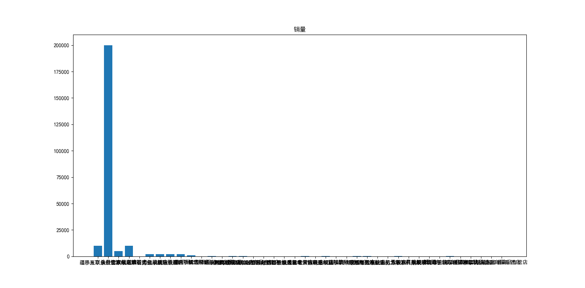
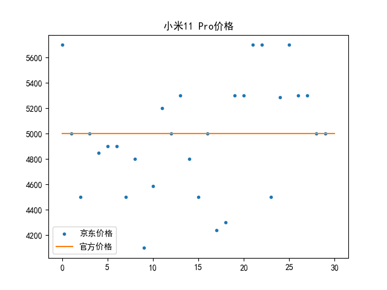
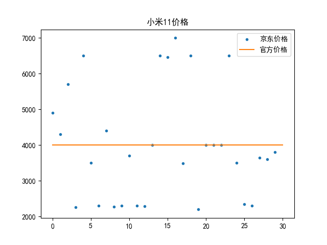
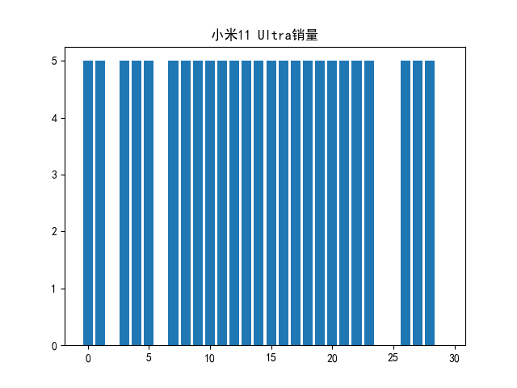
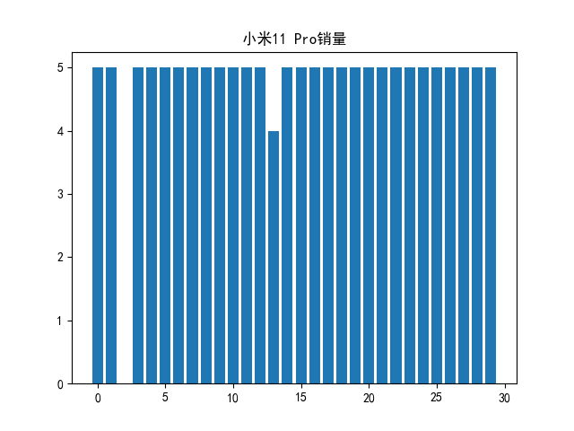
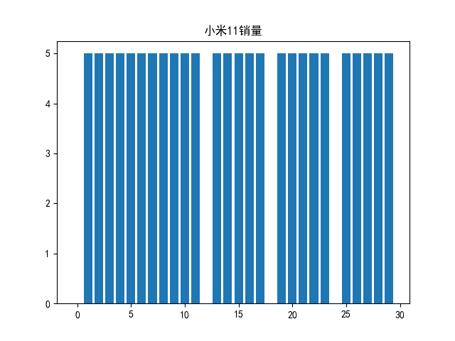
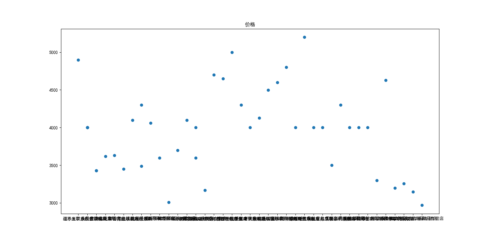
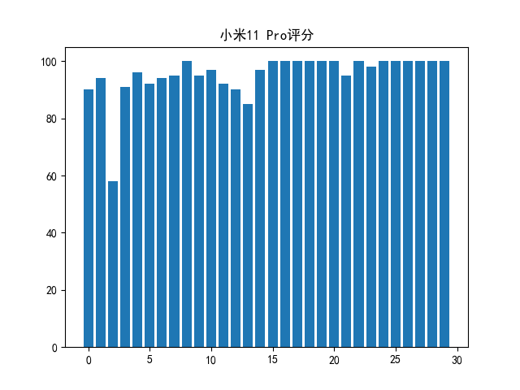

# 商品比价分析

## 摘要

实验选取了小米11系列作为研究对象，比对了官方和第三方的价格，统计了第三方的销量和评分，发现第三方平台店铺的价格可以作为产品的市场竞争力的参考，如果第三方普遍存在溢价，就证明这款产品是成功的。

### 关键词：价格，评分，销量

## 背景

电子商务通常是指在全球各地广泛的商业贸易活动中，在因特网开放的网络环境下，基于客户端/服务端应用方式，买卖双方不谋面地进行各种商贸活动，实现消费者的网上购物、商户之间的网上交易和在线电子支付以及各种商务活动、交易活动、金融活动和相关的综合服务活动的一种新型的商业运营模式。各国政府、学者、企业界人士根据自己所处的地位和对电子商务参与的角度和程度的不同，给出了许多不同的定义。电子商务分为：ABC、B2B、B2C、C2C、B2M、M2C、B2A（即B2G）、C2A（即C2G）、O2O等。

电子商务是因特网爆炸式发展的直接产物，是网络技术应用的全新发展方向。因特网本身所具有的开放性、全球性、低成本、高效率的特点，也成为电子商务的内在特征，并使得电子商务大大超越了作为一种新的贸易形式所具有的价值，它不仅会改变企业本身的生产、经营、管理活动，而且将影响到整个社会的经济运行与结构。以互联网为依托的“电子”技术平台为传统商务活动提供了一个无比宽阔的发展空间，其突出的优越性是传统媒介手段根本无法比拟的。

越来越多的人通过第三方电子商务交易平台成为站内经营者，其中不乏一些官方授权或抢购倒卖的商家，他们大多都有自主定价权，这就加剧了第三方平台的竞争，同时也影响了消费者的购物体验。

## 前期准备

1. 正则表达式 

   正则表达式是一种用来匹配字符串的强有力的工具。它的设计思想是用一种描述性的语言来给字符串定义一个规则，凡是符合规则的字符串，我们就认为它“匹配”了，否则，该字符串就是不合法的。

   通过自学正则表达式，在后续的实验中，能够更轻松的从网页源代码中获取想要的数据。

2. 网页数据抓取相关知识

   通过课本的介绍，我选择了urllib模块对网页数据进行抓取。

## 数据获取

1. 从小米获取了官方的价格。

   1. 使用`urlopen(url: str | Request).read()`打开URL
   2. 使用`BeautifulSoup(markup="", features=None)`构造器
   3. 使用`find_all(name=None, **kwargs)`查看此Page Element的子元素，并找到符合给定条件的所有Page Element。
   4. 使用`split(pattern: AnyStr@split, string: AnyStr@split)`根据模式的匹配情况拆分源字符串，返回包含结果子字符串的列表。
   5. 使用`match(pattern: AnyStr@match, string: AnyStr@match).group()`尝试在字符串的开头应用模式，返回匹配对象，如果没有找到匹配，则不返回匹配对象。

2. 从京东获取了优先展示的30家店铺的价格、销量和评分。

   用同样的方法获取数据，发现获取的数据存在异常，原因是京东具有反爬虫机制。从[CSDN]([python爬虫 - Urllib库及cookie的使用_皮皮blog-CSDN博客](https://blog.csdn.net/pipisorry/article/details/47905781))上找到设置headers避开反爬虫机制的方法，获取的数据恢复正常。

评价因为小米官网的动态的，京东官网不知道什么原因，都获取不到。销量的获取似乎也有点问题。

## 数据可视化

1. 价格对比

   以官方价格绘制基线，将第三方价格以散点图的方式展示。

   小米11 Ultra作为小米数字系列的顶级旗舰产品，大多数第三方的价格都高于官方价格，这说明官方对高端的溢价不明显，同时也说明了市场对于这款产品的信心。

   

   小米11 Pro作为小米数字系列的高端旗舰产品，第三方价格相比官方价格，较高的和较低的店铺数量几乎相等，这说明官方对该产品的定价精准，非常符合市场预期。

   

   小米11作为小米数字系列入门的旗舰，第三方价格更多的比官方价格要低，一方面是因为发布时间较久，另一方面是因为供货充足，第三方选择降低价格获得更大的竞争力。

   

2. 销量展示

   小米11 Ultra销量： 125.0  
   小米11 Pro销量： 144.0  
   小米11销量： 130.0

   对30家店铺的销量用柱状图的形式展示（单位：万）

   

   

   

3. 评分展示

   小米11 Ultra评分： 90.36666666666666  
   小米11 Pro评分： 95.3  
   小米11评分： 85.76666666666667

   对30家店铺的评分用柱状图的形式展示（单位：%）

   

   

   

## 结论

小米近两年冲击高端已显成效，但对于顶级旗舰的定价相对保守。第三方平台店铺的价格可以作为产品的市场竞争力的参考，如果第三方普遍存在溢价，就证明这款产品是成功的。

